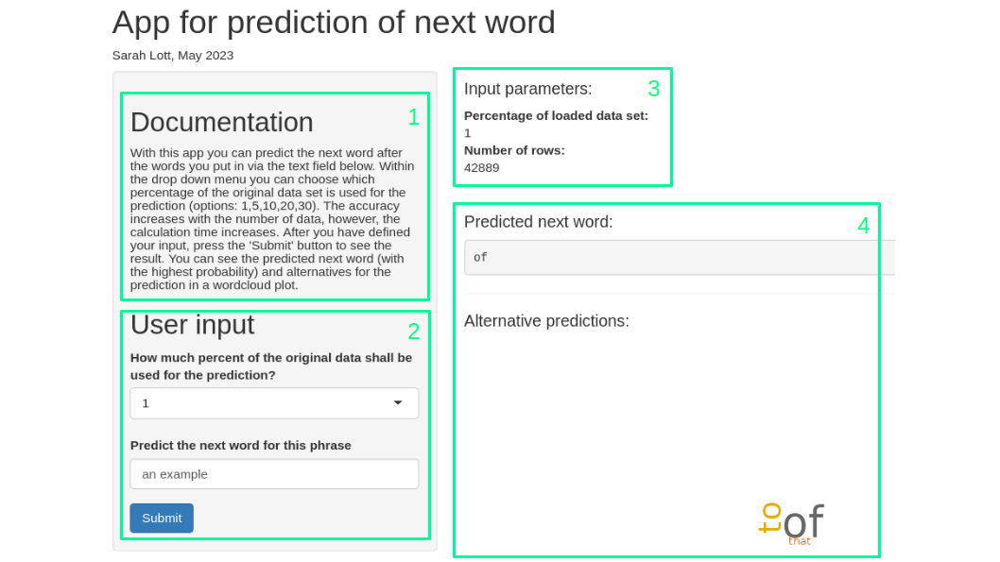

```{r setup, include=FALSE}
knitr::opts_chunk$set(echo = FALSE)
```


## Basic idea of the app
<font size="5">
This app can be used for prediction of the next word after a user defined phrase.

You type in a phrase 

&rarr; the app predicts the next word 

&rarr; how great is that?


Basis for this prediction is the data provided on this website https://d396qusza40orc.cloudfront.net/dsscapstone/dataset/Coursera-SwiftKey.zip

</font> 


## Structure of the app
{width=75%}


```{r}
library(kableExtra)

df <- data.frame("Section" = c("1", "2", "3", "4"), 
                 "Description" = c("Description of the app",
                                   "User input - choose the data set and the type in your phrase",
                                   "Display of the input parameters",
                                   "Display of the prediction"))

df %>%
  kable("html") %>%
  kable_styling(font_size = 12)

```


## Descripton of the algorithm
<font size="4">

The data used for the prediction in the app is a randomly selected partial data set.

For the natural language processing the R-package quanteda is used.

* Step 1: preprocessing of the user input (convert to lower case, remove leading and/or trailing whitespace, count number of words for the n-gram algorithm)
* Step 2: filter the data set according to the user input &rarr; only the filtered lines are considered in the following, this saves computational effort
* Step 3: construct a tokens object 
* Step 4: create a set of n-grams (tokens in sequence) from the tokenized text object
* Step 5: use kwic() function to find the indexes of the token positions for the input phrase
* Step 6: extract the subsequent words of the input phrase from the kwic data frame
* Step 7: analyse the frequency of the subsequent words

</font> 

## Advantages of the app

* user input is automatically preprocessed 
* input of different phrase lengths possible
* the user can balance accuracy and speed himself
* alternative predictions are displayed additionally

&rarr; Outstanding user friendliness   {width=3%}

* the code is written in such a universal way that it can be easily adapted for other languages

&rarr; Easily expandable   {width=3%}